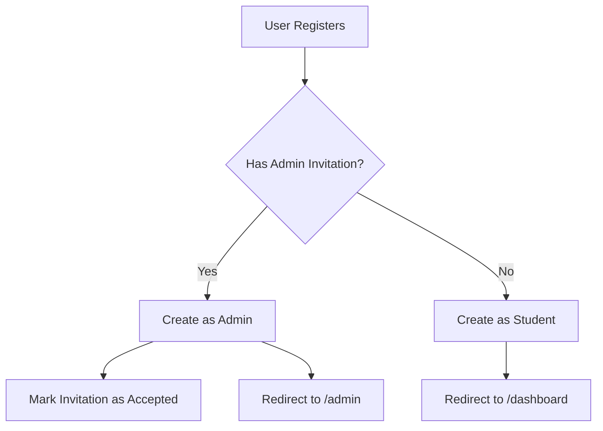

# Admin Setup Guide

This guide explains how to create and manage admin users in the CampusEvents platform.

---

## 🔐 Two Ways to Create Admins

### **Method 1: Manual Admin Creation (Database Access Required)**

Use this method to create the **first admin** or for direct database management.

#### Steps:

1. **Register a normal user account**
   - Go to `/register`
   - Create account with desired admin email (e.g., `admin@college.edu`)

2. **Promote to admin via Supabase SQL Editor**
   ```sql
   UPDATE public.users 
   SET role = 'admin' 
   WHERE email = 'admin@college.edu';
   ```

3. **Verify admin role**
   ```sql
   SELECT id, email, name, role 
   FROM public.users 
   WHERE role = 'admin';
   ```

4. **Login and test**
   - Login with the admin account
   - You should see "Admin" in the navbar
   - Access `/admin` dashboard

---

### **Method 2: Admin Invitation System (Recommended)**

Once you have one admin, they can invite others without database access.

#### Setup (One-Time):

1. **Run the invitation schema SQL**
   - Go to Supabase Dashboard → SQL Editor
   - Copy and run: `supabase/admin-invitations.sql`

#### How to Invite New Admins:

1. **Login as an existing admin**

2. **Go to Admin Invitations**
   - Navigate to `/admin/invitations`
   - Or click "Invite Admin" from the admin dashboard

3. **Enter the invitee's email**
   - Type their email address
   - Click "Invite"

4. **Share the registration link**
   - Copy the generated link (expires in 7 days)
   - Send it to the person you're inviting
   - Example: `https://your-app.com/register?email=newadmin@college.edu&invited=true`

5. **Invitee registers**
   - They click the link and register normally
   - **Automatically becomes admin** upon registration
   - Redirected to `/admin` dashboard

---

## 📋 Admin Invitation Management

### View Invitations

Go to `/admin/invitations` to see:
- **Pending invitations** (not yet accepted)
- **Accepted invitations** (user registered)
- **Expired invitations** (>7 days old)

### Manage Invitations

- **Resend** - Generate a new invitation for the same email
- **Revoke** - Cancel a pending invitation
- **Status tracking** - See who invited whom and when

---

## 🔍 How It Works

### Registration Flow



### Invitation Lifecycle

1. **Created** - Admin sends invitation
2. **Pending** - Waiting for user to register (7 days)
3. **Accepted** - User registered successfully
4. **Expired** - 7 days passed or manually revoked

---

## 🛡️ Security Features

### Invitation System

- ✅ **Time-limited** - Invitations expire after 7 days
- ✅ **Email-specific** - Tied to exact email address
- ✅ **One-time use** - Automatically consumed on registration
- ✅ **Auditable** - Track who invited whom and when
- ✅ **Revocable** - Can be cancelled before use

### RLS Policies

- ✅ Only admins can create invitations
- ✅ Only admins can view invitations list
- ✅ Only admins can revoke invitations
- ✅ System automatically validates invitations during registration

---

## 🚀 Quick Start for Evaluators/Testers

### Option A: Manual (If you have Supabase access)

```sql
-- Create first admin
INSERT INTO auth.users (email, encrypted_password, email_confirmed_at)
VALUES ('admin@test.com', crypt('password123', gen_salt('bf')), now());

UPDATE public.users 
SET role = 'admin' 
WHERE email = 'admin@test.com';
```

### Option B: Via Application

1. Register a user at `/register`
2. Ask someone with Supabase access to run:
   ```sql
   UPDATE public.users SET role = 'admin' WHERE email = 'your-email@example.com';
   ```
3. Logout and login again
4. Navigate to `/admin/invitations`
5. Invite additional admins via the UI

---

## 🎯 Admin Capabilities

Once a user has admin role, they can:

- ✅ Create, edit, delete events
- ✅ View all registrations
- ✅ Check-in students via QR code
- ✅ Send announcements
- ✅ View analytics
- ✅ **Invite other admins** (new!)
- ✅ Access `/admin/*` routes

---

## 📊 Checking Current Admins

### Via SQL
```sql
SELECT 
  id,
  email,
  name,
  role,
  created_at
FROM public.users 
WHERE role = 'admin'
ORDER BY created_at DESC;
```

### Via Application
- Login as admin
- Go to `/admin` dashboard
- Stats card shows total admins count

---

## 🔧 Troubleshooting

### "Unauthorized: Only admins can invite other admins"
- **Cause**: Your account doesn't have admin role
- **Fix**: Run SQL to promote yourself to admin (Method 1)

### "User already exists. Use role management to promote them."
- **Cause**: Email is already registered as a student
- **Fix**: Promote existing user via SQL:
  ```sql
  UPDATE public.users SET role = 'admin' WHERE email = 'existing@user.com';
  ```

### "No valid invitation found" during registration
- **Cause**: Invitation expired or was revoked
- **Fix**: Admin needs to resend invitation from `/admin/invitations`

### Invitation link doesn't work
- **Cause**: Link may be expired (>7 days)
- **Fix**: Admin clicks "Resend" in invitations table

---

## 💡 Best Practices

1. **Start with one admin** - Use Method 1 to create first admin
2. **Use invitations for others** - All subsequent admins via invitation system
3. **Monitor invitation status** - Regularly check `/admin/invitations`
4. **Revoke unused invitations** - Clean up after 7 days
5. **Document admin changes** - Keep track of who has admin access

---

## 🆘 Need Help?

### Common Scenarios

**Scenario 1: New project, no admins exist**
→ Use Method 1 (Manual) to create first admin

**Scenario 2: Have one admin, need more**
→ Use Method 2 (Invitations) via `/admin/invitations`

**Scenario 3: Evaluator testing the project**
→ Register normally, then ask for SQL promotion (Method 1)

**Scenario 4: Production deployment**
→ Create first admin manually, then use invitations exclusively

---

## 📝 Database Schema

### admin_invitations table
```sql
- id: uuid (primary key)
- email: text (unique, invited email)
- invited_by: uuid (admin who sent invitation)
- token: text (unique, auto-generated)
- status: text (pending | accepted | expired)
- expires_at: timestamptz (7 days from creation)
- created_at: timestamptz
- accepted_at: timestamptz (null until accepted)
```

### Helper Functions
- `has_valid_admin_invitation(email)` - Check if email has pending invitation
- `accept_admin_invitation(email, user_id)` - Process invitation on registration
- `cleanup_expired_invitations()` - Mark old invitations as expired

---

## ✅ Verification Checklist

After setting up admin system:

- [ ] Can create first admin via SQL
- [ ] First admin can access `/admin` dashboard
- [ ] First admin can access `/admin/invitations`
- [ ] Can send invitation to new email
- [ ] Invitation link generated correctly
- [ ] New user registers with invited email
- [ ] New user becomes admin automatically
- [ ] New user redirected to `/admin` (not `/dashboard`)
- [ ] Invitation marked as "Accepted"
- [ ] Can revoke pending invitations
- [ ] Expired invitations show correct status

---

**Summary**: Use **Method 1 (Manual SQL)** for the first admin, then **Method 2 (Invitations)** for all subsequent admins. This provides security, audit trail, and ease of use. 🎉
