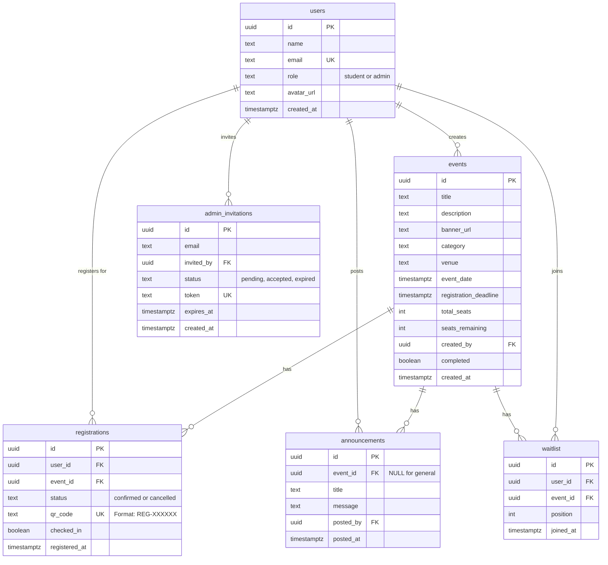

# 🎓 Campus Events Management Platform

A comprehensive full-stack web application for managing college events, student registrations, and event check-ins with QR code technology.

## 🌐 Live Demo & Video

| Resource | Link |
|----------|------|
| **🚀 Live Application** | [https://event-portal-eu.vercel.app/](https://event-portal-eu.vercel.app/) |
| **🎥 Demo Video** | *[Coming Soon - Will be added]* |

[](https://nextjs.org/)
[](https://www.typescriptlang.org/)
[](https://supabase.com/)
[](https://tailwindcss.com/)
[](https://vercel.com/)

---

## 📋 Table of Contents

- [Overview](#-overview)
- [Features](#-features)
- [Technology Stack](#-technology-stack)
- [Database Schema](#-database-schema)
- [Getting Started](#-getting-started)
- [Project Structure](#-project-structure)
- [Key Highlights](#-key-highlights)
- [Screenshots](#-screenshots)
- [Documentation](#-documentation)

---

## 🎯 Overview

The Campus Events Management Platform is a modern, scalable solution designed to streamline event management in educational institutions. It provides separate interfaces for students and administrators, featuring real-time updates, QR code-based check-ins, and comprehensive analytics.

### Purpose
- Centralize event information and registration
- Automate check-in processes with QR technology
- Provide insights through analytics dashboard
- Enhance student engagement with events

---

## ✨ Features

### For Students
- 🔐 **Secure Authentication** - Email/password with password reset
- 🎫 **Event Discovery** - Browse, search, and filter events
- 📝 **One-Click Registration** - Simple registration process
- 📱 **QR Code Tickets** - Automatic QR code generation
- 📊 **Personal Dashboard** - Track registrations and attendance
- 📅 **Calendar View** - Visual event calendar
- 🔔 **Announcements** - Receive event updates


### For Administrators
- 🎪 **Event Management** - Create, edit, and delete events
- 📸 **QR Code Scanner** - Three scanning methods (camera/image/manual)
- 📊 **Analytics Dashboard** - Comprehensive event statistics
- 👥 **Admin Invitations** - Invite and manage administrators
- 📣 **Announcements** - Post updates to students
- 📋 **Registration Management** - View and manage registrations
- ✅ **Real-Time Check-ins** - Live check-in tracking

---

## 🛠 Technology Stack

### Frontend
- **Framework:** Next.js 14 (App Router, TypeScript)
- **Styling:** Tailwind CSS
- **UI Components:** Shadcn/ui (Radix UI)
- **Icons:** Lucide React
- **Notifications:** Sonner

### Backend
- **Database:** Supabase (PostgreSQL)
- **Authentication:** Supabase Auth
- **Storage:** Supabase Storage
- **Email:** Custom Email API

### Libraries
- **QR Code Generation:** qrcode
- **QR Code Scanning:** jsQR
- **Form Management:** React Hook Form
- **Validation:** Zod
- **Date Utilities:** date-fns

### Deployment
- **Hosting:** Vercel
- **Database:** Supabase Cloud
- **CDN:** Vercel Edge Network

---

## 🗄 Database Schema

### Entity Relationship Diagram



### Key Database Features
- **Row-Level Security (RLS)** - Enforced data access control
- **Stored Procedures** - Atomic operations for seat management
- **Indexes** - Optimized query performance
- **Constraints** - Data integrity enforcement
- **Cascading Deletes** - Automatic cleanup of related data

---

## 🚀 Getting Started

### Prerequisites
- Node.js 18+ 
- npm or yarn
- Supabase account

### Installation

1. **Clone the repository**
   ```bash
   git clone <repository-url>
   cd campus-events
   ```

2. **Install dependencies**
   ```bash
   npm install
   ```

3. **Set up environment variables**
   Create `.env.local` file:
   ```env
   NEXT_PUBLIC_SUPABASE_URL=your_supabase_url
   NEXT_PUBLIC_SUPABASE_ANON_KEY=your_supabase_anon_key
   NEXT_PUBLIC_APP_URL=http://localhost:3000
   ```

4. **Set up database**
   - Create a new Supabase project
   - Run migrations from `/supabase/migration.sql`
   - Enable Row Level Security (RLS)

5. **Run development server**
   ```bash
   npm run dev
   ```

6. **Open browser**
   Navigate to `http://localhost:3000`

### Initial Setup

1. **Register first user** at `/register`
2. **Make user admin** via Supabase SQL Editor:
   ```sql
   UPDATE users SET role = 'admin' WHERE email = 'your-email@example.com';
   ```
3. **Access admin panel** at `/admin`

---

## 📁 Project Structure

```
campus-events/
├── src/
│   ├── app/
│   │   ├── (auth)/          # Authentication pages
│   │   ├── (main)/          # Main application pages
│   │   │   ├── admin/       # Admin panel pages
│   │   │   ├── dashboard/   # Student dashboard
│   │   │   ├── events/      # Event pages
│   │   │   └── profile/     # User profile
│   │   └── api/             # API routes
│   ├── components/
│   │   ├── admin/           # Admin components
│   │   ├── dashboard/       # Dashboard components
│   │   ├── layout/          # Layout components
│   │   └── ui/              # UI components
│   ├── lib/
│   │   ├── actions/         # Server actions
│   │   ├── supabase/        # Supabase utilities
│   │   └── utils.ts         # Utility functions
│   └── types/               # TypeScript types
├── supabase/                # Database migrations
└── public/                  # Static assets
```

---

## 🎯 Key Highlights

### 1. QR Code Check-in System
- **Three input methods**: Camera scanning, image upload, manual entry
- **Works on all devices**: Desktop webcam and mobile camera support
- **Real-time validation**: Instant check-in confirmation
- **Duplicate prevention**: 3-second cooldown between same code scans
- **Haptic feedback**: Vibration on successful scan (mobile)

### 2. Atomic Seat Management
- **No overbooking**: Database-level seat reservation
- **Concurrent handling**: Multiple simultaneous registrations
- **Automatic waitlist**: Overflow management
- **Auto-promotion**: Waitlist to confirmed on cancellation

### 3. Role-Based Access Control
- **Student role**: Browse and register for events
- **Admin role**: Full platform management
- **Invitation system**: Secure admin onboarding
- **Protected routes**: Middleware authentication

### 4. Real-Time Updates
- **Instant seat updates**: Live availability display
- **Check-in tracking**: Real-time check-in status
- **Dashboard sync**: Automatic data refresh
- **Cache revalidation**: Optimized data fetching

### 5. Responsive Design
- **Mobile-first**: Optimized for smartphones
- **Tablet support**: Adapted layouts
- **Desktop experience**: Full-featured interface
- **Dark mode**: System preference detection

---

## 📸 Screenshots

### Student Interface
- Event Discovery Page
- Event Details & Registration
- Personal Dashboard
- QR Code Ticket

### Admin Interface
- Admin Dashboard
- Event Management
- QR Code Scanner
- Analytics Dashboard
- Admin Invitations

---

## 📖 Documentation

For detailed documentation, see:
- **[PROJECT_DOCUMENTATION.md](./PROJECT_DOCUMENTATION.md)** - Complete feature documentation
- **[Database Schema](./supabase/migration.sql)** - Database structure
- **[API Documentation](#)** - API endpoints (if applicable)

---

## 🔒 Security Features

- ✅ Secure authentication (Supabase Auth)
- ✅ Password hashing (bcrypt)
- ✅ JWT session tokens
- ✅ Row-level security (RLS)
- ✅ SQL injection prevention
- ✅ XSS protection
- ✅ CSRF tokens
- ✅ Input validation
- ✅ Secure file uploads
- ✅ HTTPS enforcement

---

## ⚡ Performance

- ✅ Server-side rendering (SSR)
- ✅ Static generation where applicable
- ✅ Image optimization
- ✅ Code splitting
- ✅ Lazy loading
- ✅ Database query optimization
- ✅ CDN delivery
- ✅ Caching strategies

---

## 🧪 Testing

```bash
# Run development server
npm run dev

# Build for production
npm run build

# Start production server
npm start

# Type checking
npm run type-check
```

---

## 📦 Deployment

### Vercel (Recommended)

1. Push code to GitHub
2. Import project in Vercel
3. Configure environment variables
4. Deploy

### Environment Variables for Production
```env
NEXT_PUBLIC_SUPABASE_URL=your_production_url
NEXT_PUBLIC_SUPABASE_ANON_KEY=your_production_key
NEXT_PUBLIC_APP_URL=https://your-domain.com
```


